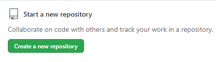
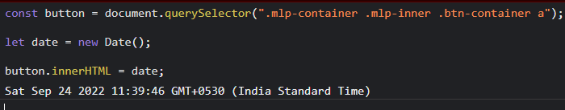

# Dom Manipulation Assignment

# 1. Webiste Name: [Dev To](https://dev.to/)

> Task : 
Target the top description and change the name to Name and the bottom description lines to my passion.
### Sample Image :

### Output :

### Code :

# 2. Website Name: [Apple](https://support.apple.com/en-in)

> Task : 
Fetch all the product name and store in an array

### Sample Image :

### Output : 

['iPhone', 'Mac', 'iPad', 'Watch', 'AirPods', 'Music', 'TV']

### Code :

# 3. Webiste Name: [Youtube Support](https://support.google.com/youtube/)

> Task: Add another FAQ 'My New FAQ' to the list
### Sample Image :

### Output :

### Code :

# 4. Webiste Name: [OnePlus](https://www.oneplus.in/support)
> Task: 
      Change the contact number
### Sample Image :

### Output : 

### Code :

# 5. Webiste Name: [Samsung](https://www.samsung.com/in/offer/online/samsung-fest/)

> Tasks :
 Target the main div of card and change the Button text to Check out

### Sample Image :

### Output :

### Code :

# 6. Webiste Name: [Adidas](https://www.adidas.co.in/)
> Tasks :
 Target the search box and on hover change thebackground color to red.

### Sample Image :

### Output :

### Code :

# 7. Webiste Name: [MDN Web Docs](https://developer.mozilla.org/en-US/)
> Task :
     To Search a topic in the MDN Search bar.
     First add a text to search in the search bar and then hit the submit search button to search the docs using DOM

 ### Sample Image :

### Output :

### Code :

# 8. Webiste Name: [Google](https://www.google.com/)
> Tasks : 
 Remove alternate languages from the home page languages listed

 ### Sample Image :

### Output :

### Code :

# 9. Webiste Name: [Code Wars](https://www.codewars.com/)

> Tasks :
 Change the font family of the text to monospace and text color to the logo’s background color.
 ### Sample Image : 

### Output :

### Code :

# 10. Webiste Name: [Freecodecamp](https://www.freecodecamp.org/)

> Tasks :
Target the button and change background colour on mouseover

### Sample Image :

### Output :

### Code :

# 11. Webiste Name: [realme](https://www.realme.com/in/)

> Tasks :
 change the realme logo to ineuron logo

### Sample Image :

### Output :

### Code :

# 12. Webiste Name: [Github](https://github.com/)

> Tasks :
 change the background colour of the button to blue.

### Sample Image :

### Output :

### Code :

# 13. Webiste Name: [Hackerrank](https://www.hackerrank.com/)

> Tasks :
Target the top description and change “Matching developers with great companies” to ‘JSBOOTCAMP“.

### Sample Image :

### Output :

### Code :

# 14. Webiste Name: [Asus](https://www.asus.com/in/)

> Tasks :
change the fontsize of “Hot Deals” to 80px

### Sample Image :

### Output :

### Code :

# 15. Webiste Name: [Dell](https://www.dell.com/en-in/shop/deals/laptop-deals?gacd=10415953-9016-5761040-285981356-0&dgc=ST&gclid=Cj0KCQjwguGYBhDRARIsAHgRm4-XUDMhhVNyHXb3s1gY4ZBzORr_d9Se-buhJwy7asyUe7YdqEA11eEaAt6UEALw_wcB&gclsrc=aw.ds&nclid=BxjBlpBQsX6pjSHh-L8YYSU77EpfXRkG1AGMB5Wbeu386ykspfrPDnfx_DdFau20)

> Tasks :
 Convert the text “G15 Gaming Laptop” from left to right

### Sample Image :

### Output :

### Code :

# 16. Webiste Name: [Vercel](https://vercel.com/)

> Tasks : change the heading “Start with the developer” to “Start with Scratch”

### Sample Image :

### Output :

### Code :

# 17. Webiste Name: [Sony](https://www.sony.co.in/)

> Tasks :
change the button text To current Date.

### Sample Image :

### Output :

### Code :

# 18. Webiste Name: [Philips](https://www.philips.co.in/)

> Tasks :
 change the background colour blue to orange

### Sample Image :

### Output :

### Code :

# 19. Webiste Name: [Canon](https://in.canon/)

> Tasks :
extract the canon logo

### Sample Image :

### Output :

### Code :

# 20. Webiste Name: [Oppo](https://www.oppo.com/in/)

>  Tasks :
Change the description colour black to orange

### Sample Image :

### Output :

### Code :

